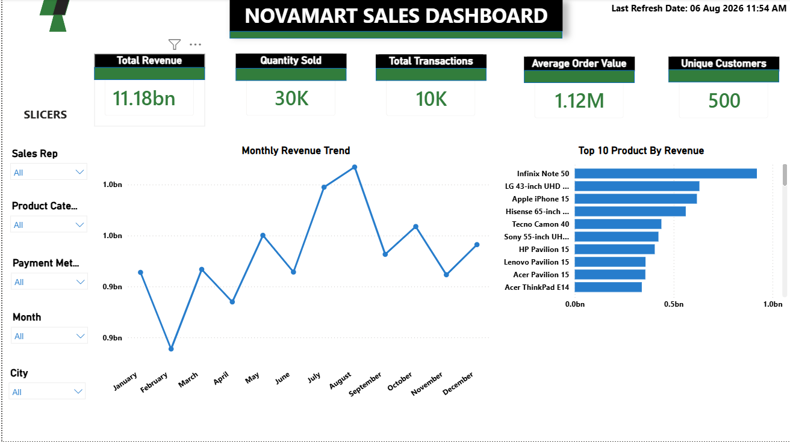
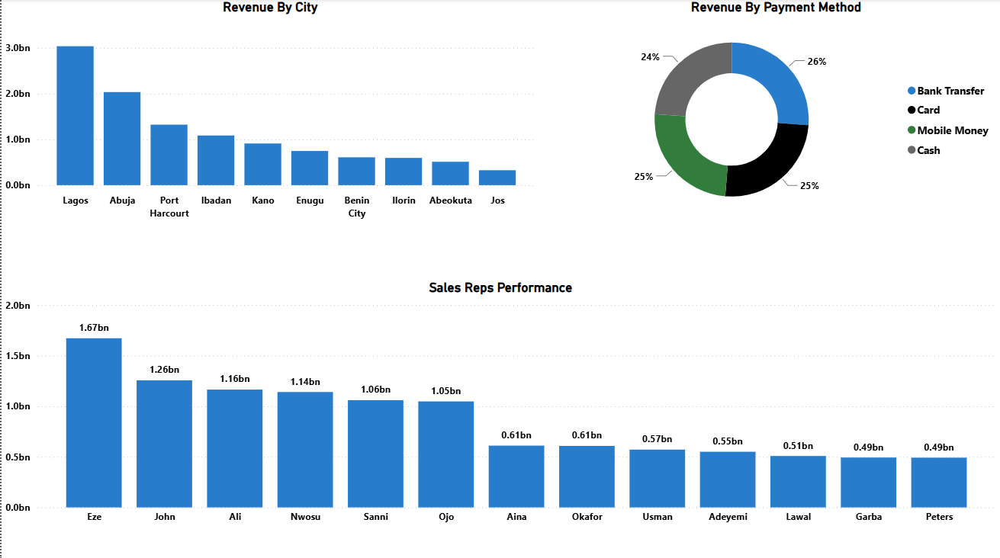

# NovaMart Sales Analysis Dashboard

# Project Overview
NovaMart Sales Analysis is a business intelligence project built using MySQL and Power BI to analyze sales performance, customer behavior, product performance, and revenue trends.

The project includes:
- Database design in MySQL
- SQL business analysis queries
- Interactive Power BI dashboard
- Sales performance insights

For detailed project documentation, see Project_Overview.pdf.

---

# Tools Used
- MySQL
- SQL
- Power BI
- GitHub

---
# Dataset
The project contains:
- Customers
- Products
- Sales
- Sales Representatives
- Suppliers

---
Total Records:
- 10,000 Sales Transactions
- 500 Customers
- 120 products
- 20 salesreps
- 30 suppliers

---
# Key KPIs
- Total Revenue: ₦11.18bn
- Quantity Sold: 30K
- Total Transactions: 10K
- Average Order Value: ₦1.12M
- Unique Customers: 500

---

# Dashboard Preview

 Page 1


 Page 2


---

# Key Insights
- August recorded the highest monthly revenue.
- Lagos generated the highest revenue among all cities.
- Infinix Note 50 was the top-performing product by revenue.
- Eze was the highest-performing sales representative.
- Bank Transfer was the most used payment method.

---

# Repository Structure

```text
Customers.csv
Products.csv
Sales.csv
SalesReps.csv
Suppliers.csv

NovaMart_Database.sql
NovaMart_Analysis.sql

NovaMart_Sales_Dashboard.pbix

Project_Overview.pdf

Dashboard_page1.png
Dashboard_page2.png
```

# Author
Omolaja Uthman
Data Analyst Portfolio Project
